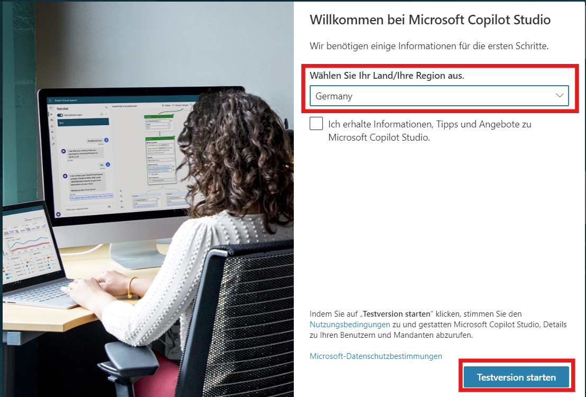
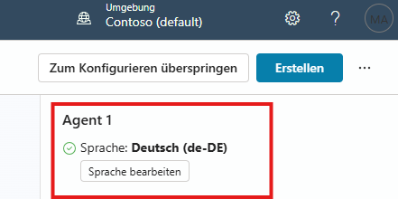

# Task 01: Erstelle einen Agenten mit einem Prompt

**Öffnen eines Inkognito-Fensters in deinem Browser (Edge: InPrivate, Chrome: Inkognito), um sicherzustellen, dass du nicht mit deinem persönlichen Microsoft-Konto angemeldet bist.**

Gehe auf folgenden Link: [copilotstudio.microsoft.com](https://copilotstudio.microsoft.com/)

Anmeldung mit den vorliegenden Zugangsdaten.

Bei manchen Accounts muss die Testversion gestartet werden, hierzu auf den Button „**Testversion starten**“ klicken.Falls dies nicht aufkommt, ist der Account bereits aktiviert.

Wir wollen uns ansehen, wie du mit Copilot Studio ganz schnell einen eigenen Agenten mit grundlegenden Einstellungen über Prompts anlegst.

Wähle im linken Menü „**Startseite**“ aus.

Gib in das Textfeld oben auf der Seite „Beschreiben Sie Ihren Agenten, um ihn zu erstellen“ den **folgenden Prompt ein**:

Ich bin Sales Manager für einen Surface Laptop Laden. Erstelle einen Sales Manager Assistant, der mir Fragen zu den Laptops beantworten kann. Füge die Webseite als Quelle hinzu und nutze diese: (https://www.microsoft.com/de-de/surface)

Drücke die Eingabetaste (**Enter**) oder klicke auf das Senden-Symbol unten rechts im Textfeld. Du wirst dann zu einer Konversationsansicht weitergeleitet, in der du deinen Agenten weiter anpassen kannst. Der Assistent hilft dir dabei, einige grundlegende Einstellungen vorzukonfigurieren.

Bestätige das nutzen der Internetquelle.

Stelle sicher, dass unser Bot auf deutsch ist: 

Gib kurze Antworten auf seine Fragen, ganz nach Belieben. Die Fragen, die gestellt werden, und deren Reihenfolge können gegenüber dem unten gezeigten Screenshot abweichen. 

Beobachte, wie deine konfigurierten Einstellungen im rechten Bereich zusammengefasst angezeigt werden.

Wähle oben rechts auf der Seite „Erstellen“ aus.

Deine Zusammenfassung der Einstellungen wird wahrscheinlich nicht identisch mit dem Screenshot aussehen.

Test Frage: **“Wenn ich ein Gerät möchte, das sowohl als Laptop als auch als Tablet arbeiten kann, welches Modell sollte ich dann wählen?
 ”**

** **
Wir haben jetzt erfolgreich einen grundlegenden Agenten erstellt! Fügen wir nun einige interne Daten hinzu.

** **
Hier geht es zum nächsten Task: [Task 02 – Unternehmensdaten](task02.md)

Hier findest du alle Tasks des Workshops:

1. [Task 01 – Prompt-Agent](task01.md)  
2. [Task 02 – Unternehmensdaten](task02.md)  
3. [Task 03: Überblick über die Benutzeroberfläche von Microsoft Copilot Studio](task03.md)  
4. [Task 04 – Copilot-Topic](task04.md)  
5. [Task 05: Ausblick Wissensquellen](task05.md) 
6. [Task 06: Ausblick Kanäle](task06.md) 
