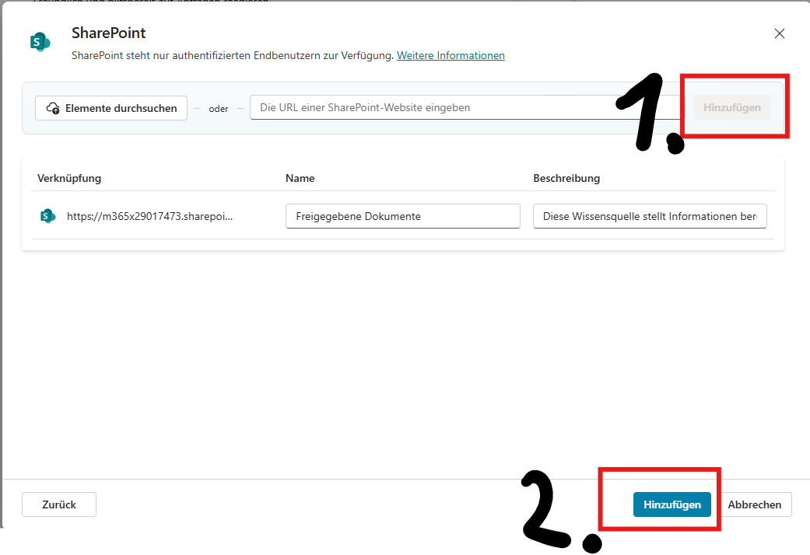
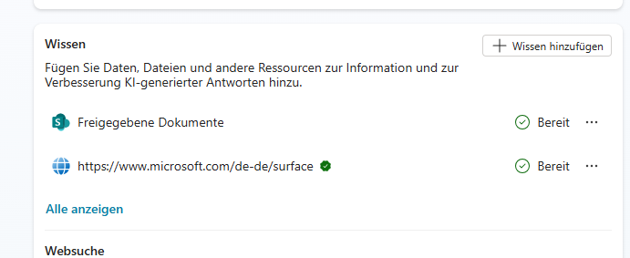
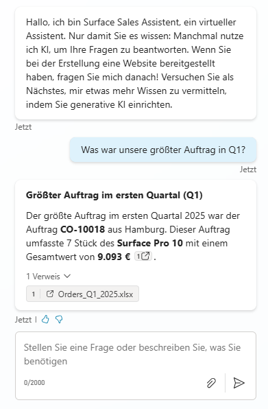
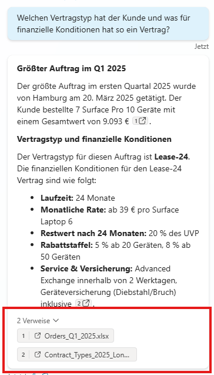

# Task 02: Füge Unternehmensdaten als Quelle hinzu

Finde innerhalb des neuen Assistenten den Reiter “**Wissen**” und drück “**Wissen hinzufügen**”

In dem Sharepoint sind Dokumenten über die Aufträge aus Q1 und die Vertragsbedingungen der Contoso Electronics enthalten.

Wähle “**SharePoint”** aus und füge folgenden Link hinzu: **"https://m365x29017473.sharepoint.com/sites/Retail-Operations/Freigegebene%20Dokumente/"**

Hierzu Link einfügen URL in Kasten eintragen, oben “**Hinzufügen**” drücken und dann die Eingabe durch das untere “**Hinzufügen**” bestätigen:

Der Sharepoint sollte jetzt unter Wissen eingetragen sein:

Man kann immer direkt in der Umgebung den Agenten Testen:

Bei bereits getesteten Bots, 4-5 Sekunden nach dem letzten Speichern den Test Bereich neu laden: 

In dem hinzugefügten SharePoint liegen Informationen zu den Aufträgen aus Q1 sowie der Vertragsbedingungen der Contoso Electronics. Wir testen den Bot mit folgender **Eingabe**: **“****Was war unsere größter Auftrag in Q1****?”**

Wir können jetzt zusätzlich Rückfragen dazu stellen und sehen immer Transparent unter der Antwort woher die Informationen kommen. **Eingabe: “****Welchen Vertragstyp hat der Kunde und was für finanzielle Konditionen hat so ein Vertrag?**** ****“**

Wir haben jetzt erfolgreich unseren Agenten mit internen Daten angereichert! Lasst uns jetzt weitere Möglichkeiten erkunden, wie wir den Agenten erweitern können.

** **
**Als nächstes betrachten wir bereits konfigurierten Agenten, da dieser auf Englisch ist, wechseln wir in Englische:**

** **
Hier geht es zum nächsten Task: [Task 03: Überblick über die Benutzeroberfläche von Microsoft Copilot Studio](task03.md)

Hier findest du alle Tasks des Workshops:

1. [Task 01 – Prompt-Agent](task01.md)  
2. [Task 02 – Unternehmensdaten](task02.md)  
3. [Task 03: Überblick über die Benutzeroberfläche von Microsoft Copilot Studio](task03.md)  
4. [Task 04 – Copilot-Topic](task04.md)  
5. [Task 05: Ausblick Wissensquellen](task05.md)  