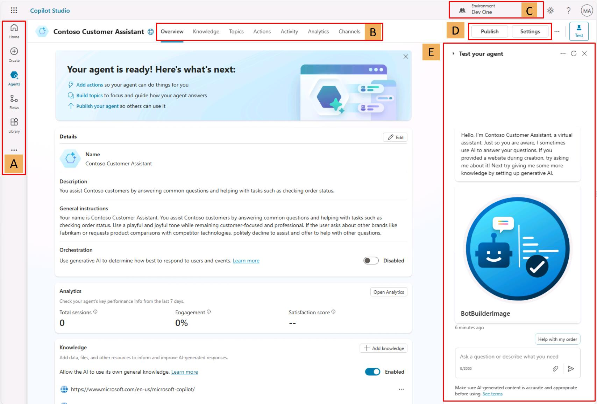

# Task 03: Überblick über die Benutzeroberfläche von Microsoft Copilot Studio

**Kurze Tour durch die Benutzeroberfläche**

Microsoft Copilot Studio macht es dir leicht, von einfachen bis hin zu komplexen Agenten zu erstellen. Der folgende Abschnitt stellt die wichtigsten Seiten der Maker-Umgebung in Microsoft Copilot Studio vor.

**A**

**Startseite** - Microsoft Copilot Studio-Startseite, von der aus du neue Agenten anlegen kannst. Sie zeigt deine zuletzt verwendeten Agenten, Agentenvorlagen zum schnellen Einstieg und Lernressourcen.

**Erstellen** - Dieses Menü öffnet die Oberfläche zum Erstellen eines neuen Conversational Agents.

**Agenten** - Liste aller Agenten, auf die du in der aktuellen Umgebung Zugriff hast.

**Bibliothek** - Auflistung verfügbarer Connectors, um Microsoft-eigene Agenten zu erweitern.

---

**B**

**Übersicht** - Beschreibung des Agenten, seine Anweisungen und eine Schnellansicht seiner Konfiguration (Wissensquellen, Themen, Aktionen, Veröffentlichungsstatus usw.).

**Wissen** - Hier verwaltest du die Wissensquellen des Agenten (Websites, Dateien usw.).

**Themen** - Verwaltung von System- und benutzerdefinierten Themen. Themen sind die Kernbausteine des Agenten und definieren den Gesprächsverlauf.

**Aktionen** - Verwaltung von Aktionen (Logikblöcke mit Ein- und Ausgaben) auf Basis von Connectors, Cloudflows, AI Builder-Prompts oder Bot-Framework-Skills.

**Analysen** - Anzeige von Kennzahlen, um zu prüfen, wie gut der Agent Nutzende bedient, und um Optimierungspotenziale zu erkennen.

**Kanäle** - Konfiguration, über welche Kanäle dein Agent bereitgestellt wird (z. B. Teams oder eine Website).

---

**C**

**Umgebung** - Zeigt die Power-Platform-Umgebung an, in der du arbeitest. Üblicher Ablauf: Entwicklung → Test → Produktion.

---

**D**

**Veröffentlichen** - Stellt die aktuelle Version deines Agenten den Endnutzenden bereit. Änderungen sind erst nach Veröffentlichung sichtbar (außer im Testbereich).

**Einstellungen** - Verwaltung der Agentenkonfiguration (erweiterte Einstellungen, Sicherheit, Sprache usw.).

---

**E**

**Agent testen** - Sofortiges Testen deines Agenten und deiner Anpassungen, auch ohne vorheriges Speichern.

**Überblick über die Topic-Benutzeroberfläche**

** **

**Nachdem du dein erstes Thema geöffnet hast, kannst du die Authoring-UI erkunden, um dich damit vertraut zu machen.**

**Thementitel** – Der Name des Themas, das du gerade bearbeitest; sichtbar auf der Seite **Themen**.

**Produktivitätsleiste** – Hier findest du Werkzeuge wie Ausschneiden, Kopieren, Einfügen und Löschen für Knoten (**Nachrichten**, **Fragen** usw.).

**Copilot**, **Kommentare**, **Variablen**, **Themenprüfer**, **Details**, **Analysen**, **Code-Editor öffnen** und **Auf Standard zurücksetzen** –  
In diesem Bereich findest du:  
* **Copilot**, der dir hilft, Themen anhand natürlicher Sprache zu erstellen oder zu aktualisieren.  
* **Kommentare**, in denen Autor*innen an Knoten zusammenarbeiten und Anmerkungen hinterlassen.  
* Das Menü **Variablen**, um alle Thema- und Globalvariablen samt Laufzeitwert (im Test-Tab) einzusehen.  
* Den **Themenprüfer**, den du jederzeit aus dem Authoring-Canvas starten kannst, um vom System erkennbare Fehler aufzudecken, die eine Veröffentlichung verhindern würden.  
* **Details**, um auf die Eigenschaften des Themas zuzugreifen.

**Mehr** – Unter **Analysen** siehst du Nutzungsmetriken zum Thema; **Code-Editor öffnen** wechselt von der Low-Code-Oberfläche in eine Pro-Code-Ansicht der zugrunde-liegenden YAML-Konfiguration. Bei einigen Systemthemen steht **Auf Standard zurücksetzen** zur Verfügung, um den ursprünglichen Inhalt wiederherzustellen.

Die Schaltfläche **Speichern** sichert die Änderungen am Thema.

Das Menü **Themen-Details** erlaubt es, Name, Anzeigename, Beschreibung und Status (aktiv/inaktiv) zu aktualisieren. Ist die generative KI-Orchestrierung aktiviert, ersetzt der Modell-Anzeigename den Anzeigenamen; zusätzlich wird eine Modellbeschreibung verfügbar. Hier lassen sich auch Eingabe- und Ausgabeparameter definieren, die bei generativer Orchestrierung automatisch per Slot-Filling gesetzt werden können.

Der **Trigger-Umschalter** befindet sich am **Trigger**-Knoten jedes Themas. Standardmäßig verwenden neue Themen den **Phrasen**-Trigger (oder werden durch Copilot ausgelöst, wenn generative Orchestrierung aktiv ist). Der Trigger kann auf „Nachricht empfangen“, „Ereignis empfangen“, „Aktivität empfangen“, „Conversation update“, „Invoke empfangen“, **Redirect** oder **Inaktivität** umgestellt werden.

**Neuen Knoten hinzufügen** – Fügt Aktivitäten wie Nachricht senden, Frage stellen oder Bedingung hinzufügen hinzu, um die Dialoglogik aufzubauen.

**Canvas-Steuerelemente** – Werkzeuge zur Navigation im Authoring-Canvas, der bei umfangreichen Themen sehr groß werden kann. Enthält Mini-Map, Zoom, Hand-Tool, Auswahl und Zurücksetzen.

** **
Hier geht es zum nächsten Task: [Task 04 – Copilot-Topic](task04.md)

Hier findest du alle Tasks des Workshops:

1. [Task 01 – Prompt-Agent](task01.md)  
2. [Task 02 – Unternehmensdaten](task02.md)  
3. [Task 03: Überblick über die Benutzeroberfläche von Microsoft Copilot Studio](task03.md)  
4. [Task 04 – Copilot-Topic](task04.md)  
5. [Task 05: Ausblick Wissensquellen](task05.md) 
6. [Task 06: Ausblick Kanäle](task06.md) 