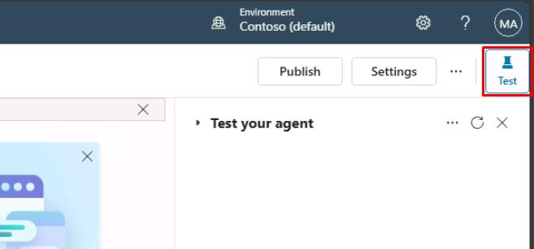

# Task 03: Test the pre-built agent

Select **Agents** in the leftmost menu.

Select **Contoso Customer Assistant**.

This is the pre-built agent you imported.

Don't use the one you created, as it won't have the necessary configurations.

You can always open and close the **Test your agent** pane by selecting **Test** in the upper-right corner of the page.

From this pane, you can immediately test any changes you save while updating the agent's configurations.

You'll see a message sent to you by the agent. This message is created from a **Conversation Start** topic, which begins automatically. You'll look at this topic later.

In the bottom text box of the **Test your agent** pane, enter Hello, then select **Enter**.

You can select messages in the test pane to get redirected to the exact topic and node it was used in. You'll learn about topics and nodes shortly!

**Quick tour of the user interface**

Microsoft Copilot Studio makes it easier for you to build basic to advanced agents. The following section reviews the main pages of the maker experience for Microsoft Copilot Studio.

**A**

**Home** - Microsoft Copilot Studio home page where you can start creating new agents from. It contains the list of recent agents, a list of agent templates to get you started, and learning resources.

**Create** - This menu gives you the conversational agent creation experience.

**Agents** - List of all the agents you have access to in the environment.

**Library** - List of connectors available for the extension of Microsoft first-party agents.

**B**

**Overview** - Description of the agent, its instructions, and a quick view of its configuration (knowledge sources, topics, actions, publish status, and so on).

**Knowledge** - Where you manage the agent knowledge sources (such as websites or files).

**Topics** - Where you manage custom and system topics. Topics are the core building blocks of an agent. Topics can be seen as the agent competencies: they define how a conversational dialog plays out. Topics are discrete conversation paths that, when used together, allow users to have a conversation that feels natural and flows appropriately.

**Actions** - Where you manage actions. Actions are pieces of logic with inputs and outputs. They leverage Power Platform components such as connectors, Power Platform cloud flows, AI Builder custom prompts, or Bot Framework skills. Actions are useful to leverage generative AI to prompt the user for the necessary inputs as well as to summarize the output of the action in the desired format.

**Analytics** - Where you can view metrics to monitor how well your agent is serving your users and identify ways to improve it.

**Channels** - Where you configure how your agent is made available to your users (for example, Teams or a website).

**C**

**Environment** - Where you can identify the Power Platform environment you're working from. You would typically create and author an agent in a development environment and deploy it to test and production environments.

**D**

**Publish** - Where you can make the latest version of your agent available to your users. Apart from the test pane, changes are not reflected to your end users if you haven't published the agent.

**Settings** - Where you can manage your agent configuration (such as advanced settings, security, and language).

**E**

**Test your agent** - Where you can immediately test your agent and your customizations, even without saving.

**Review the topic user interface**

Now that you've looked at your first topic, you can explore the authoring user interface (UI) to become more familiar with it.

**Topic title** - The name of the topic you're currently editing, visible on the **Topics** page.

**Productivity bar** - Where you have access to tools, such as cut, copy, paste, and delete for the nodes (**Messages**, **Questions**, and so on).

**Copilot**, **Comments**, **Variables**, **Topic checker**, **Details**, **Analytics**, **Open code editor**, and **Reset to default** buttons - This area includes: Copilot, which helps you create and update topics using descriptions in natural language; **Comments**, where authors can collaborate and leave comments on nodes; the **Variables** menu, to see the list of topic-level and global variables, and their runtime value in the test tab; **Topic checker**, which you can run anytime from the authoring canvas to check if errors have occurred in your topic that the platform can detect (and if left unresolved would prevent you from publishing the agent); and **Details**, to access the topic properties.

**More** - Analytics shows topic usage metrics; Open code editor switches the user interface from a no-code/low-code experience to a pro-code view of the underlying YAML configuration of the topic that developers can edit directly. For some system topics, a Reset to default option is available to revert the topic content to its original state.

The **Save** button saves the topic changes.

The **Topic details** menu allows the agent author to update the topic Name, Display name, Description, and Status (active/inactive). When generative AI orchestration is enabled, the display name is replaced with model display name, and model description becomes available. This menu also allows the configuration of inputs and outputs. The inputs can be automatically slot filled when using generative AI as the orchestrator.

The **trigger switcher** button is present at the **Trigger** node of every topic. By default, new topics have the **Phrases** trigger (or are triggered by Copilot, when generative AI orchestration is enabled), but this can be switched to Message received, Event received, Activity received, Conversation update received, Invoke received, Redirect, and Inactivity.

**Add a new node** - Allows the agent author to add activities to a topic, such as sending a message, asking a question, and adding a condition, to build the dialog logic.

**Authoring canvas controls** - You can use these controls to navigate the authoring canvas, which can become large for extensive topics. The included controls are a map of the canvas, zoom, hand, selection, and reset.

