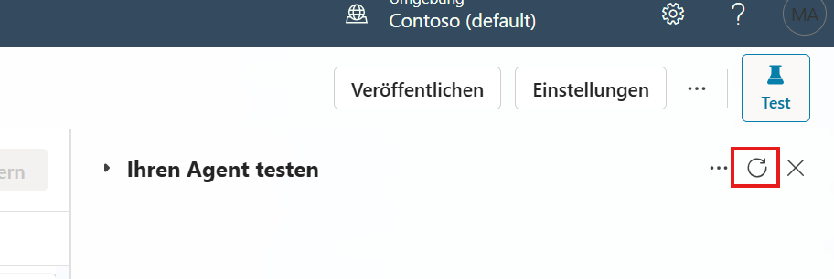

# Aufgabe 04: Mit Copilot das Thema **„Schnelles Leasing-Angebot“** erstellen

Mit Microsoft Copilot Studio kannst du Themen per natürlicher Sprache in wenigen Sekunden anlegen. Dabei erzeugt Copilot automatisch die benötigten Knoten und Antworten – ideal, um Autor*innen Zeit zu sparen.

Wähle oben in der Leiste **Themen**.

Klicke auf **Thema hinzufügen** und dann auf **Aus Beschreibung mit Copilot erstellen**.

Gib im Dialog Folgendes ein:

| Feld | Eingabe |
|------|---------|
| **Name des Themas** | **„Schnelles Leasing-Angebot“** |
| **Thema erstellen, um:** | **„Ermögliche den Nutzer*innen, schnell ein Leasing-Angebot zu erhalten. Verwende die Triggerphrasen ‚Leasingangebot‘, ‚Leasing Angebot‘, ‚Surface Leasing‘, ‚Lease quote‘. Frage nacheinander: 1) gewünschtes Surface-Modell (Buttons: Laptop 6, Pro 10, Studio 2), 2) Stückzahl, 3) Laufzeit (12 oder 24 Monate). Gib anschließend eine kurze Zusammenfassung der drei Antworten und biete an, die Leasing-Konditionen anzuzeigen.“** |

Wähle **Erstellen** unten rechts im Dialog. 

Testet gerne erneut den Bot, hierzu 4-5 Sekunden nach dem letzten Speichern den Test Bereich neu laden: 

Gib im Dialog Folgendes ein: "Leasing Angebot" und nutze dann die Buttons, um die Fragen zu beantworten.

** **
Hier geht es zum nächsten Task: [Task 05: Ausblick Wissensquellen](task05.md)

Hier findest du alle Tasks des Workshops:

1. [Task 01 – Prompt-Agent](task01.md)  
2. [Task 02 – Unternehmensdaten](task02.md)  
3. [Task 03: Überblick über die Benutzeroberfläche von Microsoft Copilot Studio](task03.md)  
4. [Task 04 – Copilot-Topic](task04.md)  
5. [Task 05: Ausblick Wissensquellen](task05.md)  
6. [Task 06 – Question / Message / Condition](task06.md)