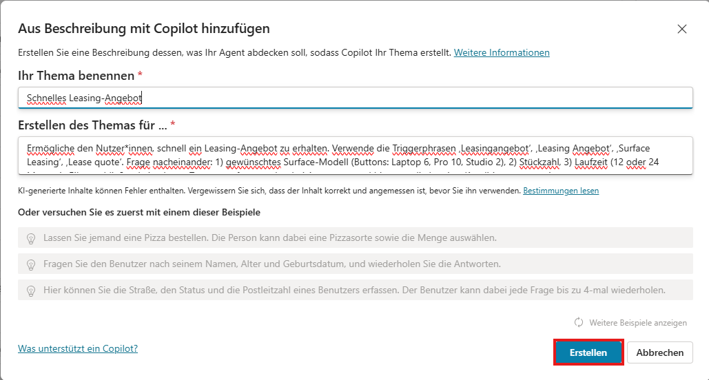

# Aufgabe 04: Mit Copilot das Thema **„Schnelles Leasing-Angebot“** erstellen

Mit Microsoft Copilot Studio kannst du Themen per natürlicher Sprache in wenigen Sekunden anlegen. Dabei erzeugt Copilot automatisch die benötigten Knoten und Antworten – ideal, um Zeit zu sparen.

Wähle oben in der Leiste **Themen**.


Klicke auf **Thema hinzufügen** und dann auf **Aus Beschreibung mit Copilot erstellen**.


Gib im Dialog Folgendes ein:
 **Name des Themas**: „Schnelles Leasing-Angebot“
**Thema erstellen, um:**:
```plaintext
Erstelle ein Topic „Schnelles Angebot“.

Triggerphrasen: „Leasingangebot“, „Gerät kaufen“, „Surface Leasing“, „Lease quote“.

Frage der Reihe nach:
1) gewünschtes Surface-Modell (Freitext, erkenne Laptop 6 | Pro 10 | Studio 2, sonst Vorschläge nennen)
2) Kauf oder Leasing? (Buttons „Kaufen“, „Leasen“)  → Variable {mode}
3) Wenn {mode}=Leasen: Laufzeit (Buttons 12 / 24 Monate) → Variable {term}
4) Stückzahl → Variable {qty}
5) „Haben Sie weitere Wünsche oder Zubehörangaben?“ (Freitext, optional) → Variable {notes}

Antwort:
• Wenn Leasing: „Vielen Dank! Für {qty} × {device} über {term} Monate erstellen wir ein Leasing-Angebot. Wir melden uns zeitnah mit den Konditionen.“  
• Wenn Kauf: „Vielen Dank! Für {qty} × {device} als Kaufangebot. Wir melden uns zeitnah mit den Konditionen.

Gib in beiden Fällen eine kurze Zusammenfassung aller Eingaben (inkl. {notes}, falls vorhanden) in der Abschlussnachricht aus. Keine weiteren Berechnungen oder externen Daten.
 |
```


Wähle **Erstellen** unten rechts im Dialog. 

Testet gerne erneut den Bot, hierzu 4-5 Sekunden nach dem letzten Speichern den Test Bereich neu laden: 

Gib im Dialog Folgendes ein: "Leasing Angebot" und nutze dann die Buttons, um die Fragen zu beantworten.


** **
Hier geht es zum nächsten Task: [Task 05: Ausblick Wissensquellen](task05.md)

Hier findest du alle Tasks des Workshops:

1. [Task 01 – Prompt-Agent](task01.md)  
2. [Task 02 – Unternehmensdaten](task02.md)  
3. [Task 03: Überblick über die Benutzeroberfläche von Microsoft Copilot Studio](task03.md)  
4. [Task 04 – Copilot-Topic](task04.md)  
5. [Task 05: Ausblick Wissensquellen](task05.md)  