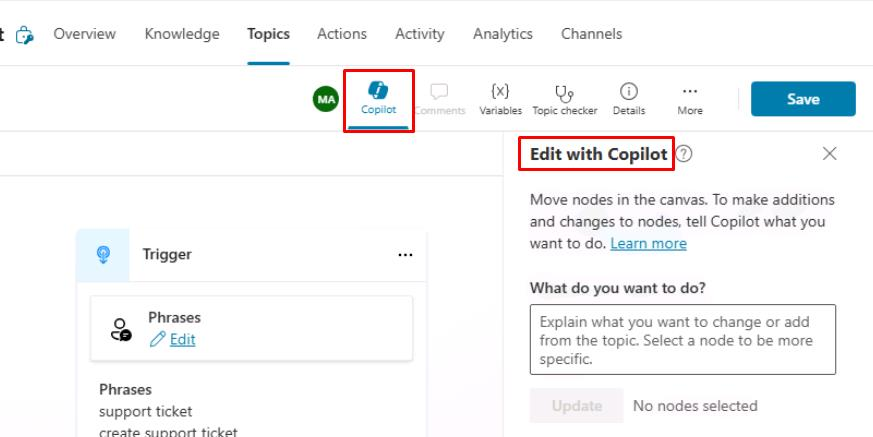

# Task 04: Use Copilot to create a topic

You can quickly create and edit topics in Copilot Studio using natural language by describing what you want to do. Copilot Studio will automatically configure the different node types and conversational responses. This feature can drastically reduce authoring time.

Select **Topics** on the top bar.

Select **Add a topic**, then select **Create from description with Copilot**.

Enter the following in the new dialog:

Select **Create** in the lower-right corner of the dialog.   

Observe the nodes in the canvas it immediately created.

If the **Edit with Copilot** pane is not already open, select **Copilot** at the top of the canvas.

In the **Edit with Copilot** pane, under **What do you want to do?**, add the following instructions, then select **Update**.

Ask a question to get the user's name, address, and phone number after their order, before providing a friendly confirmation message.

Your nodes will likely not match the previous screenshot.

The **Edit with Copilot** pane also shows what updates have been made and provides examples for what else you can do.

Select **Save** in the upper-right part of the canvas to save the topic.

