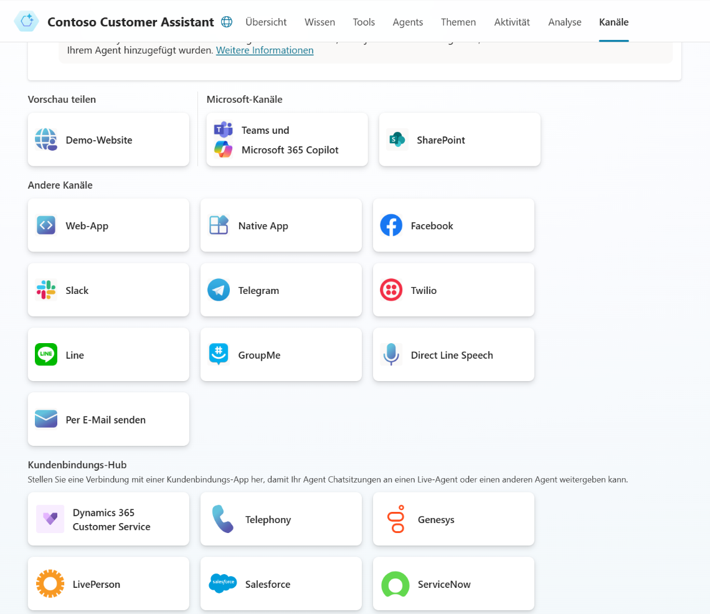

# Task 06: Ausblick Kanäle

In diesem Abschnitt gehen wir darauf ein, wie die Benutzer mit einem interaktiven Agenten interagieren. Dazu verfügt jeder Agent über ein oder mehrere sogenannten Kanäle. Ein Kanal kann z.B. eine Website, eine App, ein Teams Chat oder eine Support Anwendung wie ServiceNow sein. Der Ersteller eines Agenten legt fest, über welche Kanäle der Agent erreichbar ist. 

**Kanäle** 

Mit der Tab **Kanäle** kann der Ersteller in Copilot Studio die aktiven Kanäle für jeden Agenten konfigurieren. Abhängig von der gewählten Authentidierungsmethode sind unterschiedliche Kanaloptionen verfügbar. 

** **

Hier findest du alle Tasks des Workshops:

1. [Task 01 – Prompt-Agent](task01.md)  
2. [Task 02 – Unternehmensdaten](task02.md)  
3. [Task 03: Überblick über die Benutzeroberfläche von Microsoft Copilot Studio](task03.md)  
4. [Task 04 – Copilot-Topic](task04.md)  
5. [Task 05: Ausblick Wissensquellen](task05.md)
6. [Task 06: Ausblick Kanäle](task06.md)  