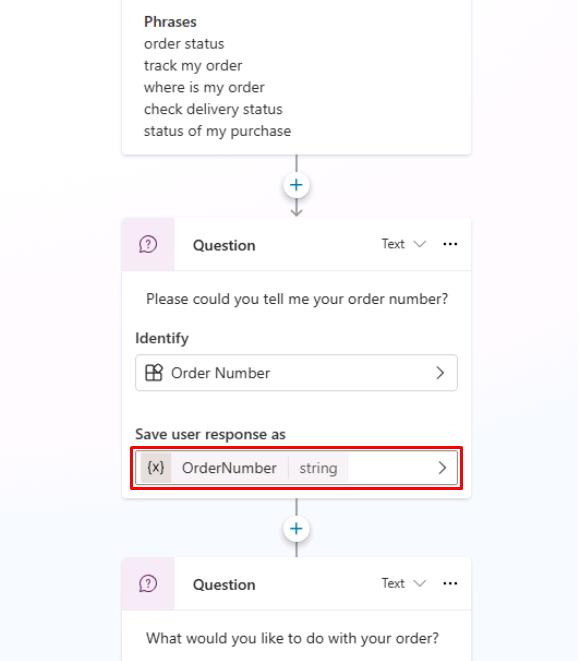

# Task 6: Explore the Question, Message, and Condition nodes

You can use the **Question** node when you're expecting a response from the user and want to do something with that information. Their response is stored in a variable for future use in the conversation.

Close the **Phrases** and **Test your agent** panes if you need more canvas space, by selecting the **X** in the upper-right corner of the panes.

Below the **Trigger** node, observe the **Question** node.

After the conversation is started, this node is configured to retrieve more details on the user's order number, then saves the user's response in a variable called **OrderNumber** to reference it for future actions.

The **Question** node below then asks the user what they'd like to do with their order, providing three options, then saves their response in a global variable called **Global.OrderRequest**.

Below the **Question** node, select the message in the **Message** node to expand its text.

This provides a confirmation message to the user, while incorporating the saved **Global.OrderRequest** variable from the previous question in its response.

Unlike the **Question** node, the **Message** node just sends a message and does not expect or store an answer from the user.

Moving below the **Message** node, the topic branches off into different conversation paths when meeting different conditions, in this case, the user's selection of what they want to do with their order.

Observe how it takes the saved variable of the user's choice in **Global.OrderRequest**, then checks to see if the user wants to **Update**/**Check**/**Cancel** their order. These all have their own separate nodes beneath them, with subsequent actions taken based on their choice.

All other responses from the user would fall into that fourth branch for **All other conditions**.

Conditions are foundational tools that help you create tailored experiences based on what the user has selected or answered in previous questions. You can even nest conditions within other conditions for more complex logic!

If the **Test your agent** pane is closed, select **Test** near the upper-right corner of the page to reopen it.

In the **Test your agent** pane, select the refresh icon in the upper-right corner to start a new conversation.

Enter the following prompt to trigger this conversation topic and see how the conversation flows:

Has my order shipped?

For the order number, enter:

ORD-001342

Select **Check** from the pre-built options it provides:

In the canvas, observe the blue line and underlines of the nodes, showing the path the conversation took to get from the **Trigger** that started the topic, to the final **Redirect** node.

